Google Data Analytics Capstone Project: Bike Share
================
Bernardo S.B.C. Lima
6/10/2021

## Set-up environemnt and load libraries

``` r
library(tidyverse) # collection of r packges for data science
```

    ## Warning: package 'tidyr' was built under R version 4.0.5

    ## Warning: package 'readr' was built under R version 4.0.5

``` r
library(lubridate) # to work with dates and times
library(janitor) # data inspection and cleaning
library(skimr) # summary statistics
library(formattable) # data formatting 
library(viridis) # color pallets
```

## Introduction

This notebook documents the steeps I took to tackle [Case Study 1: How
Does a Bike-Share Navigate Speedy
Success?](https://www.coursera.org/learn/google-data-analytics-capstone/supplement/7PGIT/case-study-1-how-does-a-bike-share-navigate-speedy-success)
of the [Google Data Analytics Capstone: Complete a Case
Study](https://www.coursera.org/learn/google-data-analytics-capstone/home/welcome)
course.

The structure of this notebook follows the six steps of the data
analysis process used in the [Google Data Analytics Professional
Certificate](https://www.coursera.org/specializations/google-data-analytics).
These steps are:  
• Ask  
• Prepare  
• Process  
• Analyze  
• Share  
• Act

## Ask

This case study is about a fictional bike-share company in Chicago
called Cyclistic. Cyclistic customers are divided into casual riders and
Cyclistic members. *Casual riders* are customers who purchase
single-ride or full-day passes and *Cyclistic members* are customers who
purchase annual memberships.

A key premise of the case is that Cyclistic members are much more
profitable than casual riders and the company’s future success depends
on maximizing the number of annual memberships. Consequently, the
marketing team wants to design a new marketing strategy to convert
casual riders into annual members. But in order to do that, the first
need to to better understand how casual riders and annual members use
Cyclistic bikes differently. Given this scenario, the questions that
I’ll try to answer in this project is “how annual members and casual
riders use Cyclistic bikes differently”?

## Prepare

To answer the question above, I use the most recent 12 months of
Cyclistic historical trip data available at the time of the analysis
(data from May 2020 to April 2021).

The data used in this project has been made available by Motivate
International Inc. under this
[license](https://www.divvybikes.com/data-license-agreement) and can
downloaded from
[here](https://divvy-tripdata.s3.amazonaws.com/index.html).

The data is available in separate comma-separated values files, one for
each individual month. The observation level of the data is the
individual ride. That is, each line contains information about an
individual ride.

It’s important to note that the data has been stripped of any personally
identifiable information in order to preserve the users’ privacy. This
means that it’s not possible to connect pass purchases to credit card
numbers to determine if casual riders live in the Cyclistic service area
or if they have purchased multiple single passes. This is an important
limitation and should be take into account when analyzing the data.

Finally, before processing and analyzing the data it’s important to
assess its quality. Given that good data is original data from a
reliable organization, comprehensive, current, vetted and relevant for
problem at hand, I conclude that data available is of high quality and
suitable to answer the project question.

### Load and merge montlhy data

Insert link to .R file with code to download the data

``` r
file_names <- dir("./data/data_raw/")
trip_data <- do.call(rbind, lapply(paste0("./data/data_raw/",file_names), read_csv))
```

    ## Multiple files in zip: reading '202005-divvy-tripdata.csv'
    ## Rows: 200274 Columns: 13
    ## ── Column specification ────────────────────────────────────────────────────────
    ## Delimiter: ","
    ## chr  (5): ride_id, rideable_type, start_station_name, end_station_name, memb...
    ## dbl  (6): start_station_id, end_station_id, start_lat, start_lng, end_lat, e...
    ## dttm (2): started_at, ended_at
    ## 
    ## ℹ Use `spec()` to retrieve the full column specification for this data.
    ## ℹ Specify the column types or set `show_col_types = FALSE` to quiet this message.
    ## Multiple files in zip: reading '202006-divvy-tripdata.csv'
    ## Rows: 343005 Columns: 13
    ## ── Column specification ────────────────────────────────────────────────────────
    ## Delimiter: ","
    ## chr  (5): ride_id, rideable_type, start_station_name, end_station_name, memb...
    ## dbl  (6): start_station_id, end_station_id, start_lat, start_lng, end_lat, e...
    ## dttm (2): started_at, ended_at
    ## 
    ## ℹ Use `spec()` to retrieve the full column specification for this data.
    ## ℹ Specify the column types or set `show_col_types = FALSE` to quiet this message.
    ## Multiple files in zip: reading '202007-divvy-tripdata.csv'
    ## Rows: 551480 Columns: 13
    ## ── Column specification ────────────────────────────────────────────────────────
    ## Delimiter: ","
    ## chr  (5): ride_id, rideable_type, start_station_name, end_station_name, memb...
    ## dbl  (6): start_station_id, end_station_id, start_lat, start_lng, end_lat, e...
    ## dttm (2): started_at, ended_at
    ## 
    ## ℹ Use `spec()` to retrieve the full column specification for this data.
    ## ℹ Specify the column types or set `show_col_types = FALSE` to quiet this message.
    ## Multiple files in zip: reading '202008-divvy-tripdata.csv'
    ## Rows: 622361 Columns: 13
    ## ── Column specification ────────────────────────────────────────────────────────
    ## Delimiter: ","
    ## chr  (5): ride_id, rideable_type, start_station_name, end_station_name, memb...
    ## dbl  (6): start_station_id, end_station_id, start_lat, start_lng, end_lat, e...
    ## dttm (2): started_at, ended_at
    ## 
    ## ℹ Use `spec()` to retrieve the full column specification for this data.
    ## ℹ Specify the column types or set `show_col_types = FALSE` to quiet this message.
    ## Multiple files in zip: reading '202009-divvy-tripdata.csv'
    ## Rows: 532958 Columns: 13
    ## ── Column specification ────────────────────────────────────────────────────────
    ## Delimiter: ","
    ## chr  (5): ride_id, rideable_type, start_station_name, end_station_name, memb...
    ## dbl  (6): start_station_id, end_station_id, start_lat, start_lng, end_lat, e...
    ## dttm (2): started_at, ended_at
    ## 
    ## ℹ Use `spec()` to retrieve the full column specification for this data.
    ## ℹ Specify the column types or set `show_col_types = FALSE` to quiet this message.
    ## Multiple files in zip: reading '202010-divvy-tripdata.csv'
    ## Rows: 388653 Columns: 13
    ## ── Column specification ────────────────────────────────────────────────────────
    ## Delimiter: ","
    ## chr  (5): ride_id, rideable_type, start_station_name, end_station_name, memb...
    ## dbl  (6): start_station_id, end_station_id, start_lat, start_lng, end_lat, e...
    ## dttm (2): started_at, ended_at
    ## 
    ## ℹ Use `spec()` to retrieve the full column specification for this data.
    ## ℹ Specify the column types or set `show_col_types = FALSE` to quiet this message.
    ## Multiple files in zip: reading '202011-divvy-tripdata.csv'
    ## Rows: 259716 Columns: 13
    ## ── Column specification ────────────────────────────────────────────────────────
    ## Delimiter: ","
    ## chr  (5): ride_id, rideable_type, start_station_name, end_station_name, memb...
    ## dbl  (6): start_station_id, end_station_id, start_lat, start_lng, end_lat, e...
    ## dttm (2): started_at, ended_at
    ## 
    ## ℹ Use `spec()` to retrieve the full column specification for this data.
    ## ℹ Specify the column types or set `show_col_types = FALSE` to quiet this message.
    ## Multiple files in zip: reading '202012-divvy-tripdata.csv'
    ## Rows: 131573 Columns: 13
    ## ── Column specification ────────────────────────────────────────────────────────
    ## Delimiter: ","
    ## chr  (7): ride_id, rideable_type, start_station_name, start_station_id, end_...
    ## dbl  (4): start_lat, start_lng, end_lat, end_lng
    ## dttm (2): started_at, ended_at
    ## 
    ## ℹ Use `spec()` to retrieve the full column specification for this data.
    ## ℹ Specify the column types or set `show_col_types = FALSE` to quiet this message.
    ## Multiple files in zip: reading '202101-divvy-tripdata.csv'
    ## Rows: 96834 Columns: 13
    ## ── Column specification ────────────────────────────────────────────────────────
    ## Delimiter: ","
    ## chr  (7): ride_id, rideable_type, start_station_name, start_station_id, end_...
    ## dbl  (4): start_lat, start_lng, end_lat, end_lng
    ## dttm (2): started_at, ended_at
    ## 
    ## ℹ Use `spec()` to retrieve the full column specification for this data.
    ## ℹ Specify the column types or set `show_col_types = FALSE` to quiet this message.
    ## Multiple files in zip: reading '202102-divvy-tripdata.csv'
    ## Rows: 49622 Columns: 13
    ## ── Column specification ────────────────────────────────────────────────────────
    ## Delimiter: ","
    ## chr  (7): ride_id, rideable_type, start_station_name, start_station_id, end_...
    ## dbl  (4): start_lat, start_lng, end_lat, end_lng
    ## dttm (2): started_at, ended_at
    ## 
    ## ℹ Use `spec()` to retrieve the full column specification for this data.
    ## ℹ Specify the column types or set `show_col_types = FALSE` to quiet this message.
    ## Multiple files in zip: reading '202103-divvy-tripdata.csv'
    ## Rows: 228496 Columns: 13
    ## ── Column specification ────────────────────────────────────────────────────────
    ## Delimiter: ","
    ## chr  (7): ride_id, rideable_type, start_station_name, start_station_id, end_...
    ## dbl  (4): start_lat, start_lng, end_lat, end_lng
    ## dttm (2): started_at, ended_at
    ## 
    ## ℹ Use `spec()` to retrieve the full column specification for this data.
    ## ℹ Specify the column types or set `show_col_types = FALSE` to quiet this message.
    ## Multiple files in zip: reading '202104-divvy-tripdata.csv'
    ## Rows: 337230 Columns: 13
    ## ── Column specification ────────────────────────────────────────────────────────
    ## Delimiter: ","
    ## chr  (7): ride_id, rideable_type, start_station_name, start_station_id, end_...
    ## dbl  (4): start_lat, start_lng, end_lat, end_lng
    ## dttm (2): started_at, ended_at
    ## 
    ## ℹ Use `spec()` to retrieve the full column specification for this data.
    ## ℹ Specify the column types or set `show_col_types = FALSE` to quiet this message.

When merging the monthly data, I noticed that the format of the
variables *start_station_id* and *end_station_id* changed during the
observation window:  
• From 202005 to 202011 they are numeric (i.e. *dbl*)  
• From 202012 to 202004 they are text (i.e. *chr*)  
This suggests that there were (some) changes in the station identifier
which makes aggregating these variables challenging. This issue,
however, does not impact the current analysis because analysis of user
behavior in terms of starting and ending stations falls outside the
scope of this project.

### Create new variables

``` r
trip_data$date <- date(trip_data$started_at) # ride date
trip_data$datehour <- floor_date(trip_data$started_at, unit = "hour") # date and hour the ride was initiated
trip_data$week_day <- wday(trip_data$started_at) # day of the week the ride was initiated (1 = Sunday and 7 = Saturday)
trip_data$ride_lenght <- difftime( trip_data$ended_at,trip_data$started_at, unit = "mins") # lenght of the ride in minutes
trip_data$ride_lenght_num <- int_length(interval(trip_data$started_at, trip_data$ended_at))/60 # lenght of the ride in minutes but as a numeric variable
trip_data$month <- month(trip_data$started_at) # month the ride was initiated
trip_data$year_month <- floor_date(trip_data$started_at, unit = "month") # year and month the ride was initiated
trip_data$year_month_week <- floor_date(trip_data$started_at, unit = "week") # year, month and week the ride was initiated
trip_data$hour <- hour(trip_data$started_at) # hour the ride was initiated

trip_data <- trip_data %>% # season 
  mutate(
    season = case_when(
      month %in%  9:11 ~ "Fall",
      month %in%  c(12, 1, 2)  ~ "Winter",
      month %in%  3:5  ~ "Spring",
      TRUE ~ "Summer"))

trip_data <- trip_data %>% # Seasons ordered: 1 = Spring, 2 = Summer, 3 = Fall, 4 = Winter
  mutate(
    season_num = case_when(
      month %in% 9:11 ~ 3,
      month %in% c(12, 1, 2) ~ 4,
      month %in% 3:5 ~ 1,
      TRUE ~ 2
    )
  )
```

### Overview of the data and descriptive statistics

``` r
glimpse(trip_data)
```

    ## Rows: 3,742,202
    ## Columns: 24
    ## $ ride_id            <chr> "02668AD35674B983", "7A50CCAF1EDDB28F", "2FFCDFDB91…
    ## $ rideable_type      <chr> "docked_bike", "docked_bike", "docked_bike", "docke…
    ## $ started_at         <dttm> 2020-05-27 10:03:52, 2020-05-25 10:47:11, 2020-05-…
    ## $ ended_at           <dttm> 2020-05-27 10:16:49, 2020-05-25 11:05:40, 2020-05-…
    ## $ start_station_name <chr> "Franklin St & Jackson Blvd", "Clark St & Wrightwoo…
    ## $ start_station_id   <chr> "36", "340", "260", "251", "261", "206", "261", "18…
    ## $ end_station_name   <chr> "Wabash Ave & Grand Ave", "Clark St & Leland Ave", …
    ## $ end_station_id     <chr> "199", "326", "260", "157", "206", "22", "261", "18…
    ## $ start_lat          <dbl> 41.8777, 41.9295, 41.9296, 41.9680, 41.8715, 41.847…
    ## $ start_lng          <dbl> -87.6353, -87.6431, -87.7079, -87.6500, -87.6699, -…
    ## $ end_lat            <dbl> 41.8915, 41.9671, 41.9296, 41.9367, 41.8472, 41.869…
    ## $ end_lng            <dbl> -87.6268, -87.6674, -87.7079, -87.6368, -87.6468, -…
    ## $ member_casual      <chr> "member", "casual", "casual", "casual", "member", "…
    ## $ date               <date> 2020-05-27, 2020-05-25, 2020-05-02, 2020-05-02, 20…
    ## $ datehour           <dttm> 2020-05-27 10:00:00, 2020-05-25 10:00:00, 2020-05-…
    ## $ week_day           <dbl> 4, 2, 7, 7, 6, 6, 4, 4, 7, 7, 5, 1, 5, 1, 2, 7, 5, …
    ## $ ride_lenght        <drtn> 12.950000 mins, 18.483333 mins, 97.300000 mins, 13…
    ## $ ride_lenght_num    <dbl> 12.950000, 18.483333, 97.300000, 13.866667, 37.2833…
    ## $ month              <dbl> 5, 5, 5, 5, 5, 5, 5, 5, 5, 5, 5, 5, 5, 5, 5, 5, 5, …
    ## $ year_month         <dttm> 2020-05-01, 2020-05-01, 2020-05-01, 2020-05-01, 20…
    ## $ year_month_week    <dttm> 2020-05-24, 2020-05-24, 2020-04-26, 2020-04-26, 20…
    ## $ hour               <int> 10, 10, 14, 16, 12, 13, 12, 18, 17, 10, 14, 8, 14, …
    ## $ season             <chr> "Spring", "Spring", "Spring", "Spring", "Spring", "…
    ## $ season_num         <dbl> 1, 1, 1, 1, 1, 1, 1, 1, 1, 1, 1, 1, 1, 1, 1, 1, 1, …

``` r
skim_without_charts(trip_data)
```

|                                                  |           |
|:-------------------------------------------------|:----------|
| Name                                             | trip_data |
| Number of rows                                   | 3742202   |
| Number of columns                                | 24        |
| \_\_\_\_\_\_\_\_\_\_\_\_\_\_\_\_\_\_\_\_\_\_\_   |           |
| Column type frequency:                           |           |
| character                                        | 8         |
| Date                                             | 1         |
| difftime                                         | 1         |
| numeric                                          | 9         |
| POSIXct                                          | 5         |
| \_\_\_\_\_\_\_\_\_\_\_\_\_\_\_\_\_\_\_\_\_\_\_\_ |           |
| Group variables                                  | None      |

Data summary

**Variable type: character**

| skim_variable      | n_missing | complete_rate | min | max | empty | n_unique | whitespace |
|:-------------------|----------:|--------------:|----:|----:|------:|---------:|-----------:|
| ride_id            |         0 |          1.00 |  16 |  16 |     0 |  3741993 |          0 |
| rideable_type      |         0 |          1.00 |  11 |  13 |     0 |        3 |          0 |
| start_station_name |    148231 |          0.96 |  10 |  53 |     0 |      711 |          0 |
| start_station_id   |    148857 |          0.96 |   1 |  35 |     0 |     1265 |          0 |
| end_station_name   |    171317 |          0.95 |  10 |  53 |     0 |      712 |          0 |
| end_station_id     |    171778 |          0.95 |   1 |  35 |     0 |     1266 |          0 |
| member_casual      |         0 |          1.00 |   6 |   6 |     0 |        2 |          0 |
| season             |         0 |          1.00 |   4 |   6 |     0 |        4 |          0 |

**Variable type: Date**

| skim_variable | n_missing | complete_rate | min        | max        | median     | n_unique |
|:--------------|----------:|--------------:|:-----------|:-----------|:-----------|---------:|
| date          |         0 |             1 | 2020-05-01 | 2021-04-30 | 2020-09-09 |      363 |

**Variable type: difftime**

| skim_variable | n_missing | complete_rate | min            | max           | median    | n_unique |
|:--------------|----------:|--------------:|:---------------|:--------------|:----------|---------:|
| ride_lenght   |         0 |             1 | -29049.97 mins | 54283.35 mins | 14.3 mins |    26877 |

**Variable type: numeric**

| skim_variable   | n_missing | complete_rate |   mean |     sd |        p0 |    p25 |    p50 |    p75 |     p100 |
|:----------------|----------:|--------------:|-------:|-------:|----------:|-------:|-------:|-------:|---------:|
| start_lat       |         0 |             1 |  41.90 |   0.04 |     41.64 |  41.88 |  41.90 |  41.93 |    42.08 |
| start_lng       |         0 |             1 | -87.64 |   0.03 |    -87.87 | -87.66 | -87.64 | -87.63 |   -87.52 |
| end_lat         |      4906 |             1 |  41.90 |   0.04 |     41.54 |  41.88 |  41.90 |  41.93 |    42.16 |
| end_lng         |      4906 |             1 | -87.65 |   0.03 |    -88.07 | -87.66 | -87.64 | -87.63 |   -87.44 |
| week_day        |         0 |             1 |   4.18 |   2.09 |      1.00 |   2.00 |   4.00 |   6.00 |     7.00 |
| ride_lenght_num |         0 |             1 |  24.46 | 372.56 | -29049.97 |   7.78 |  14.30 |  26.35 | 54283.35 |
| month           |         0 |             1 |   7.28 |   2.63 |      1.00 |   6.00 |   8.00 |   9.00 |    12.00 |
| hour            |         0 |             1 |  14.33 |   4.63 |      0.00 |  11.00 |  15.00 |  18.00 |    23.00 |
| season_num      |         0 |             1 |   2.26 |   0.87 |      1.00 |   2.00 |   2.00 |   3.00 |     4.00 |

**Variable type: POSIXct**

| skim_variable   | n_missing | complete_rate | min                 | max                 | median              | n_unique |
|:----------------|----------:|--------------:|:--------------------|:--------------------|:--------------------|---------:|
| started_at      |         0 |             1 | 2020-05-01 00:02:07 | 2021-04-30 23:59:53 | 2020-09-09 15:51:13 |  3257750 |
| ended_at        |         0 |             1 | 2020-05-01 00:13:03 | 2021-05-05 22:14:39 | 2020-09-09 16:08:31 |  3245372 |
| datehour        |         0 |             1 | 2020-05-01 00:00:00 | 2021-04-30 23:00:00 | 2020-09-09 15:00:00 |     8639 |
| year_month      |         0 |             1 | 2020-05-01 00:00:00 | 2021-04-01 00:00:00 | 2020-09-01 00:00:00 |       12 |
| year_month_week |         0 |             1 | 2020-04-26 00:00:00 | 2021-04-25 00:00:00 | 2020-09-06 00:00:00 |       53 |

### Data cleaning and validation

I addition of checking for duplicates and missing, I also assessed the
validity of the data in the terms of:  
• Data type: does the the data matches the data type defined for a
field?  
• Data range: does the data falls within an acceptable range of values
defined for the field?  
• Data constraints: does the data meets certain conditions or criteria
for a field? This includes the type of data entered as well as other
attributes of the field, such as number of characters.  
• Data consistency: does the data makes sense in the context of other
related data?  
• Code validation: does the application code systematically performs any
of the previously mentioned validations during user data input?

Some observation from this process:  
• The initial dataset has 3,742,202 rows (i.e. individual rides) and 24
columns (i.e. variables).  
• There are no missing values in our variables of interest. There is
small number of missing data (less than 5 percent) for the variables
identifying the starting and ending stations, and the end latitude and
longitude of the ride (less than 0.1 percent). Given that these
variables will not be used in the analysis, I did not delete these
observations.  
• The variable ride_id does not uniquely identify each ride. There is a
small number of duplicates (209).  
• The variable *date* has 363 unique values, which indicates that there
are missing data for two full days.  
• The variable *ride_lenght* captures the length of a ride and was
calculated by subtracting *started_at* from *ended_at*.

``` r
trip_data %>% filter(ride_lenght <= 0) %>% 
  summarise(number_rows = n())
```

    ## # A tibble: 1 × 1
    ##   number_rows
    ##         <int>
    ## 1       10917

• There are 10,917 observations with negative or zero *ride_lenght*.
These observations fail the data consistency check and will be deleted.

``` r
# delete observations where 'ride_lenght' is smaller than or equal to zero (10917 rows). 
trip_data_clean <- trip_data %>% filter(ride_lenght > 0) 
```

### Descriptive statistics of the clean dataset

``` r
skim_without_charts(trip_data_clean)
```

|                                                  |                 |
|:-------------------------------------------------|:----------------|
| Name                                             | trip_data_clean |
| Number of rows                                   | 3731285         |
| Number of columns                                | 24              |
| \_\_\_\_\_\_\_\_\_\_\_\_\_\_\_\_\_\_\_\_\_\_\_   |                 |
| Column type frequency:                           |                 |
| character                                        | 8               |
| Date                                             | 1               |
| difftime                                         | 1               |
| numeric                                          | 9               |
| POSIXct                                          | 5               |
| \_\_\_\_\_\_\_\_\_\_\_\_\_\_\_\_\_\_\_\_\_\_\_\_ |                 |
| Group variables                                  | None            |

Data summary

**Variable type: character**

| skim_variable      | n_missing | complete_rate | min | max | empty | n_unique | whitespace |
|:-------------------|----------:|--------------:|----:|----:|------:|---------:|-----------:|
| ride_id            |         0 |          1.00 |  16 |  16 |     0 |  3731285 |          0 |
| rideable_type      |         0 |          1.00 |  11 |  13 |     0 |        3 |          0 |
| start_station_name |    148179 |          0.96 |  10 |  53 |     0 |      711 |          0 |
| start_station_id   |    148805 |          0.96 |   1 |  35 |     0 |     1265 |          0 |
| end_station_name   |    171109 |          0.95 |  10 |  53 |     0 |      712 |          0 |
| end_station_id     |    171570 |          0.95 |   1 |  35 |     0 |     1266 |          0 |
| member_casual      |         0 |          1.00 |   6 |   6 |     0 |        2 |          0 |
| season             |         0 |          1.00 |   4 |   6 |     0 |        4 |          0 |

**Variable type: Date**

| skim_variable | n_missing | complete_rate | min        | max        | median     | n_unique |
|:--------------|----------:|--------------:|:-----------|:-----------|:-----------|---------:|
| date          |         0 |             1 | 2020-05-01 | 2021-04-30 | 2020-09-09 |      363 |

**Variable type: difftime**

| skim_variable | n_missing | complete_rate | min       | max           | median     | n_unique |
|:--------------|----------:|--------------:|:----------|:--------------|:-----------|---------:|
| ride_lenght   |         0 |             1 | 0.02 mins | 54283.35 mins | 14.35 mins |    26047 |

**Variable type: numeric**

| skim_variable   | n_missing | complete_rate |   mean |     sd |     p0 |    p25 |    p50 |    p75 |     p100 |
|:----------------|----------:|--------------:|-------:|-------:|-------:|-------:|-------:|-------:|---------:|
| start_lat       |         0 |             1 |  41.90 |   0.04 |  41.64 |  41.88 |  41.90 |  41.93 |    42.08 |
| start_lng       |         0 |             1 | -87.64 |   0.03 | -87.87 | -87.66 | -87.64 | -87.63 |   -87.52 |
| end_lat         |      4847 |             1 |  41.90 |   0.04 |  41.54 |  41.88 |  41.90 |  41.93 |    42.16 |
| end_lng         |      4847 |             1 | -87.65 |   0.03 | -88.07 | -87.66 | -87.64 | -87.63 |   -87.44 |
| week_day        |         0 |             1 |   4.18 |   2.09 |   1.00 |   2.00 |   4.00 |   6.00 |     7.00 |
| ride_lenght_num |         0 |             1 |  27.43 | 237.20 |   0.02 |   7.83 |  14.35 |  26.40 | 54283.35 |
| month           |         0 |             1 |   7.28 |   2.64 |   1.00 |   6.00 |   8.00 |   9.00 |    12.00 |
| hour            |         0 |             1 |  14.33 |   4.63 |   0.00 |  11.00 |  15.00 |  18.00 |    23.00 |
| season_num      |         0 |             1 |   2.26 |   0.87 |   1.00 |   2.00 |   2.00 |   3.00 |     4.00 |

**Variable type: POSIXct**

| skim_variable   | n_missing | complete_rate | min                 | max                 | median              | n_unique |
|:----------------|----------:|--------------:|:--------------------|:--------------------|:--------------------|---------:|
| started_at      |         0 |             1 | 2020-05-01 00:02:07 | 2021-04-30 23:59:53 | 2020-09-09 16:26:23 |  3252749 |
| ended_at        |         0 |             1 | 2020-05-01 00:13:03 | 2021-05-05 22:14:39 | 2020-09-09 16:43:17 |  3237742 |
| datehour        |         0 |             1 | 2020-05-01 00:00:00 | 2021-04-30 23:00:00 | 2020-09-09 16:00:00 |     8639 |
| year_month      |         0 |             1 | 2020-05-01 00:00:00 | 2021-04-01 00:00:00 | 2020-09-01 00:00:00 |       12 |
| year_month_week |         0 |             1 | 2020-04-26 00:00:00 | 2021-04-25 00:00:00 | 2020-09-06 00:00:00 |       53 |

• The new dataset has 3,731,285 obervations.  
• It is important to note that dropping the observations with unfeasible
*ride_lengths* also got rid of the duplicated *ride_id*.  
• That is, *ride_id* now uniquely identify each ride.

``` r
trip_data_clean %>% 
  summarise(unique_ride_id = n_distinct(ride_id), number_rows = n())
```

    ## # A tibble: 1 × 2
    ##   unique_ride_id number_rows
    ##            <int>       <int>
    ## 1        3731285     3731285

## Analyze

### Consumer type

The variable member_casual distinguishes if the trip was done by a
casual rider or a annual member.

``` r
trip_data_clean %>% 
  group_by(member_casual) %>% 
  summarise(n_rides = n()) %>% 
  mutate(share = percent(n_rides / sum(n_rides))) %>% 
  bind_rows(summarise(.,
                      across(where(is.numeric), sum),
                      across(where(is.character), ~"Total")))
```

    ## # A tibble: 3 × 3
    ##   member_casual n_rides share     
    ##   <chr>           <int> <formttbl>
    ## 1 casual        1539944 41.27%    
    ## 2 member        2191341 58.73%    
    ## 3 Total         3731285 100.00%

Mean, median and max ride lenght per user type.

``` r
trip_data_clean %>% 
  group_by(member_casual) %>% 
  summarise(n_rides = n(), 
            median_length = round(median(ride_lenght, na.rm = T),1), 
            mean_length = round(mean(ride_lenght, na.rm = T),1),
            max_lenght = round(max(ride_lenght, na.rm = T),1))
```

    ## # A tibble: 2 × 5
    ##   member_casual n_rides median_length mean_length max_lenght  
    ##   <chr>           <int> <drtn>        <drtn>      <drtn>      
    ## 1 casual        1539944 20.9 mins     43.9 mins   54283.3 mins
    ## 2 member        2191341 11.3 mins     15.8 mins   41271.0 mins

The table above shows that, on average, **casual members\` trips (median
= 20.9 mins) are almost twice longer than annual members rides (median =
11.3 mins)**.  
I use the median instead of the mean because the descriptive statistics
for ride length (see descriptive for *ride_lenght_num* above) show that
the distribution of this variable is quite skewed due a few very long
rides. In the presence of outliers, the median is preffered over the
mean.

### Bike type

The variable *rideable_type* identifies the type of bike used. There are
3 types of bikes: docked, classic and electric.

``` r
trip_data_clean %>% 
  group_by(rideable_type) %>% 
  summarise(n_rides = n()) %>% 
  mutate(share = percent(n_rides / sum(n_rides))) %>% 
  bind_rows(summarise(.,
                    across(where(is.numeric), sum),
                    across(where(is.character), ~"Total")))
```

    ## # A tibble: 4 × 3
    ##   rideable_type n_rides share     
    ##   <chr>           <int> <formttbl>
    ## 1 classic_bike   534464 14.32%    
    ## 2 docked_bike   2487829 66.67%    
    ## 3 electric_bike  708992 19.00%    
    ## 4 Total         3731285 100.00%

**The majority of the rides are done in **docked_bikes (66,7%).\*\*

### Consumer type and bike type

``` r
trip_data_clean %>% 
  group_by(rideable_type, member_casual) %>% 
  summarise(n_rides = n()) %>% 
  mutate(percent_total = percent(n_rides / sum(n_rides))) %>% 
  select(-c(n_rides)) %>% 
  pivot_wider(names_from = member_casual, values_from = c(percent_total))
```

    ## `summarise()` has grouped output by 'rideable_type'. You can override using the
    ## `.groups` argument.

    ## # A tibble: 3 × 3
    ## # Groups:   rideable_type [3]
    ##   rideable_type casual     member    
    ##   <chr>         <formttbl> <formttbl>
    ## 1 classic_bike  26.49%     73.51%    
    ## 2 docked_bike   44.79%     55.21%    
    ## 3 electric_bike 40.05%     59.95%

The percentage usage of docked and electric bikes between casual and
members is similar to the overall distribution of rides between these
two groups. However, **classic bikes tend are used relative more by
annual members than casual riders**.

Median ride lenght by bike type and customer type.

``` r
trip_data_clean %>% 
  group_by(rideable_type, member_casual) %>% 
  summarise(median_length = round(median(ride_lenght, na.rm = T),1)) %>% 
  pivot_wider(names_from = member_casual, values_from = median_length)
```

    ## `summarise()` has grouped output by 'rideable_type'. You can override using the
    ## `.groups` argument.

    ## # A tibble: 3 × 3
    ## # Groups:   rideable_type [3]
    ##   rideable_type casual    member   
    ##   <chr>         <drtn>    <drtn>   
    ## 1 classic_bike  17.0 mins 10.1 mins
    ## 2 docked_bike   23.6 mins 12.4 mins
    ## 3 electric_bike 13.7 mins  9.4 mins

### Rides per day of the week

``` r
trip_data_clean %>% 
  group_by(week_day) %>% 
  summarise(n_rides = n(),
            median_length = round(median(ride_lenght, na.rm = T),1))
```

    ## # A tibble: 7 × 3
    ##   week_day n_rides median_length
    ##      <dbl>   <int> <drtn>       
    ## 1        1  559959 17.4 mins    
    ## 2        2  451486 13.3 mins    
    ## 3        3  469007 12.8 mins    
    ## 4        4  492080 12.8 mins    
    ## 5        5  495527 12.8 mins    
    ## 6        6  563636 13.7 mins    
    ## 7        7  699590 17.2 mins

Table above shows that the median ride lenght is considrably longer on
the weekends (1 = Sunday, and 2 = Saturday). We know that on average,
casuals rent bikes for longer periods of time than annual members.
Therefore, we need to investigate if the longer median of ‘ride_lenght’
on weekends is caused by relative more casuals renting bikes on weekends
OR members also using bikes for longer periods on weekends.

``` r
trip_data_clean %>% 
  group_by(week_day, member_casual) %>% 
  summarise(n_rides = n(),
            median_length = round(median(ride_lenght, na.rm = T),1)) %>% 
  mutate(percet_total = percent(n_rides / sum(n_rides))) %>% 
  pivot_wider(names_from = member_casual, values_from = c(n_rides, percet_total, median_length))
```

    ## `summarise()` has grouped output by 'week_day'. You can override using the
    ## `.groups` argument.

    ## # A tibble: 7 × 7
    ## # Groups:   week_day [7]
    ##   week_day n_rides_casual n_rides_member percet_total_…¹ perce…² media…³ media…⁴
    ##      <dbl>          <int>          <int> <formttbl>      <formt> <drtn>  <drtn> 
    ## 1        1         280966         278993 50.18%          49.82%  24.2 m… 12.8 m…
    ## 2        2         164506         286980 36.44%          63.56%  20.4 m… 10.7 m…
    ## 3        3         161974         307033 34.54%          65.46%  18.9 m… 10.8 m…
    ## 4        4         168575         323505 34.26%          65.74%  18.3 m… 10.8 m…
    ## 5        5         176284         319243 35.58%          64.42%  18.2 m… 10.8 m…
    ## 6        6         228942         334694 40.62%          59.38%  19.3 m… 11.1 m…
    ## 7        7         358697         340893 51.27%          48.73%  23.2 m… 12.8 m…
    ## # … with abbreviated variable names ¹​percet_total_casual, ²​percet_total_member,
    ## #   ³​median_length_casual, ⁴​median_length_member

The analyses above show that most bike trips during weekdays are done by
members (around 64 percent). But the share of trips on weekends is about
the same between annual members and casuals. In conclusion, **annual
members use Cyclistic bikes more during the week, and casual riders more
on the weekend**.

## Share

Supporting visualizations and key findings

### Seasonality

``` r
ggplot(data = trip_data_clean, aes(x = year_month_week)) + 
  geom_bar(aes(fill = factor(member_casual,
                             labels =c("Casual", "Member"))),
           position = "dodge") +
  labs(title = "Weekly number of rides per customer type",
       x = "Date",
       y = "Count of rides",
       fill = "Customer type") +
  theme_bw()
```

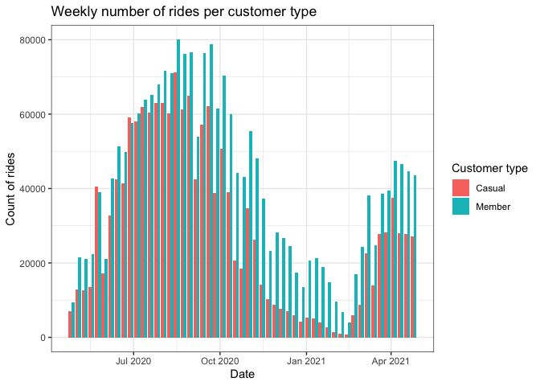<!-- --> The plots
above show a strong seasonal effect on the use of bikes. The number of
rides peak on the summer and drastically reduce in the winter. The
seasonal effect seems stronger for casual riders than annual members.

### Rides per hour and day of the week

``` r
trip_data_clean %>% 
  filter(week_day %in% c(2:6)) %>% 
  ggplot(aes(x = hour, fill = member_casual)) + 
  geom_bar(position = "dodge") + 
  labs(
    title = "Number of rides per hour during week days",
    x = "Hour", 
    fill = "Customer type",
    y = "Count of rides"
    ) +
  theme_bw()  
```

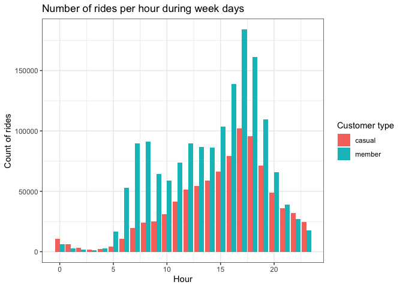<!-- --> The plot
above shows that during weekdays members use relatively more the bike in
the morning and lunch time, probably for commuting. Both groups increase
bike usage in the late afternoon and early evening. But probably for
different reasons (e.g. commuting vs going out for dinner). Extra data
is necessary to test this hypothesis.

``` r
trip_data_clean %>% 
  filter(week_day %in% c(1,7)) %>% 
  ggplot(aes(x = hour, fill = member_casual)) + 
  geom_bar(position = "dodge") + 
  labs(
    title = "Number of rides per hour during weekend",
    x = "Hour", 
    fill = "Customer type",
    y = "Count of rides"
  ) +
  theme_bw()  
```

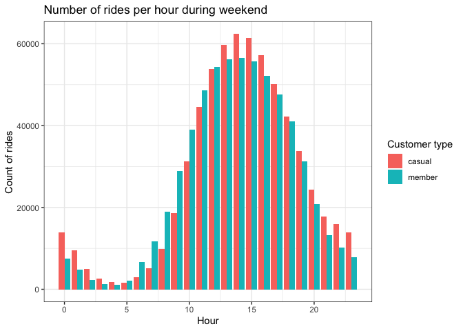<!-- --> The plot
above shows that members and casual riders have similar user behavior on
weekends.

``` r
# Number of rides per hour during week days per season 
trip_data_clean %>% 
  filter(week_day %in% c(2:6)) %>% 
  ggplot(aes(x = hour, fill = member_casual)) + 
  geom_bar(position = "dodge") + 
  facet_wrap(~season_num,
            labeller = labeller(season_num = 
                                  c("1" = "Spring",
                                    "2" = "Summer",
                                    "3" = "Fall",
                                    "4" = "Winter")
            )) +
  labs(
    title = "Number of rides per hour during week days",
    x = "Hour", 
    fill = "Customer type",
    y = "Count of rides"
  ) +
  theme_bw()
```

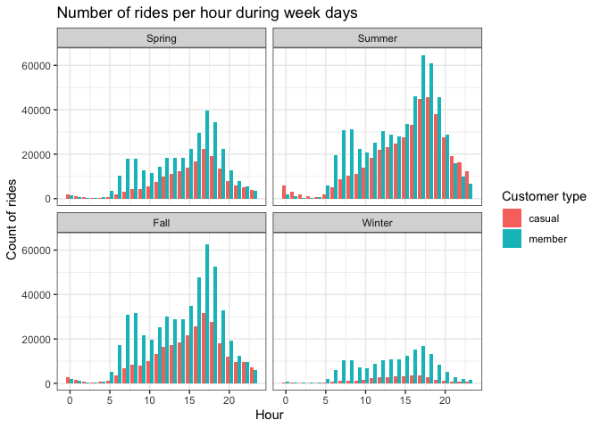<!-- -->

``` r
trip_data_clean %>% 
  filter(week_day %in% c(1,7)) %>% 
  ggplot(aes(x = hour, fill = member_casual)) + 
  geom_bar(position = "dodge") + 
  facet_wrap(~season_num,
             labeller = labeller(season_num = 
                                   c("1" = "Spring",
                                     "2" = "Summer",
                                     "3" = "Fall",
                                     "4" = "Winter")
             )) +
  labs(
    title = "Number of rides per hour during weekend",
    x = "Hour", 
    fill = "Customer type",
    y = "Count of rides"
  ) +
  theme_bw()
```

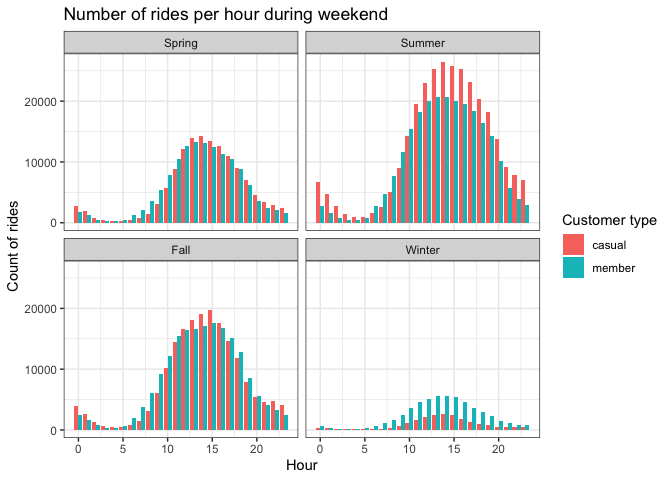<!-- --> \### Plots
at day-hour level Plots based on data aggregated at day-hour level. This
allows for a more nuanced view of the patterns.

``` r
# Create a dataset aggreagted at day-hour level
trips_per_hour <- trip_data_clean %>% 
  group_by(datehour, member_casual) %>% 
  summarise(count_rides = n(), 
            sum_lenght = as.numeric(sum(ride_lenght, na.rm = T)),
            mean_lenght = as.numeric(mean(ride_lenght, na.rm = T)),
            median_lenght = as.numeric(median(ride_lenght, na.rm = T)))
```

    ## `summarise()` has grouped output by 'datehour'. You can override using the
    ## `.groups` argument.

``` r
# Create time variables
trips_per_hour$year_month <- floor_date(trips_per_hour$datehour, unit = "month") 
trips_per_hour$month <- month(trips_per_hour$datehour)
trips_per_hour$day <- day(trips_per_hour$datehour)
trips_per_hour$week_day <- wday(trips_per_hour$datehour)
trips_per_hour$hour <- hour(trips_per_hour$datehour)
trips_per_hour <- trips_per_hour %>%
  mutate(
    season = case_when(
      month %in%  9:11 ~ "Fall",
      month %in%  c(12, 1, 2)  ~ "Winter",
      month %in%  3:5  ~ "Spring",
      TRUE ~ "Summer"))
# Seasons ordered: 1 = Spring, 2 = Summer, 3 = Fall, 4 = Winter
trips_per_hour <- trips_per_hour %>%
  mutate(
    season_num = case_when(
      month %in%  9:11 ~ 3,
      month %in%  c(12, 1, 2)  ~ 4,
      month %in%  3:5  ~ 1,
      TRUE ~ 2))
```

``` r
# Trips per customer group (Yes)
trips_per_hour %>% 
  ggplot(aes(datehour,count_rides)) + 
  geom_point(aes(color=member_casual), alpha = 0.5)  +
  theme_bw() +
  labs(title = NULL, 
       x = NULL,
       y = "Bike rides per hour",
       color = NULL)
```

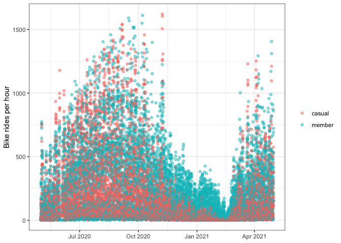<!-- -->

``` r
# Rides per season and customer type
trips_per_hour %>% 
  ggplot(aes(datehour,count_rides)) + 
  geom_point(aes(color = season), alpha=0.5) + 
  theme_bw() +
  facet_grid(member_casual~.) + # for groups side by side use => facet_wrap(~member_casual)
  labs(title = NULL, 
       x = NULL,
       y = "Bike rides per hour",
       color = NULL) 
```

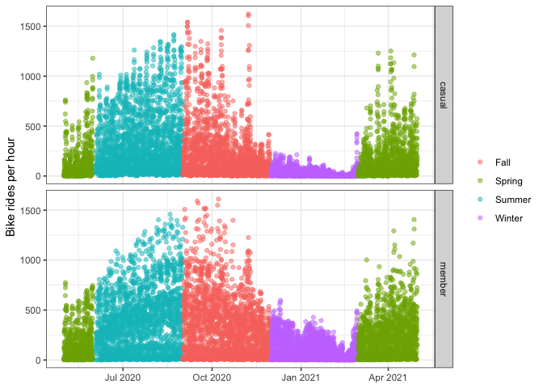<!-- --> Using
boxplots to give a better idea of the data distribution

``` r
trips_per_hour %>% 
  ggplot(aes(factor(
    season_num,
    labels = c("Spring", 
                "Summer",
                "Fall",
                "Winter")), count_rides)) + 
  geom_boxplot(aes(color = factor(
    season_num,
    labels = c("Spring", 
               "Summer",
               "Fall",
               "Winter")))) +  
  theme_bw() +
  labs(x = NULL, 
       color = "Seasons",
       y = "Bike rides per hour") +
  guides(color = FALSE) # remove legends
```

    ## Warning: `guides(<scale> = FALSE)` is deprecated. Please use `guides(<scale> =
    ## "none")` instead.

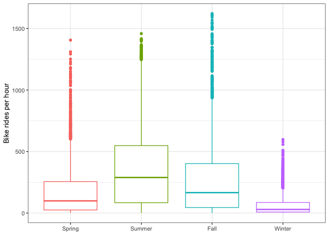<!-- -->

``` r
# Comparing customer groups 
trips_per_hour %>% 
  ggplot(aes(factor(
    season_num,
    labels = c("Spring", 
               "Summer",
               "Fall",
               "Winter")), count_rides)) + 
  geom_boxplot(aes(color = factor(
    season_num,
    labels = c("Spring", 
               "Summer",
               "Fall",
               "Winter")))) +  
  theme_bw() +
  labs(x = NULL, 
       color = "Seasons",
       y = "Bike rides per hour") +
  guides(color = FALSE) + # remove legends
  facet_grid(member_casual~.)
```

    ## Warning: `guides(<scale> = FALSE)` is deprecated. Please use `guides(<scale> =
    ## "none")` instead.

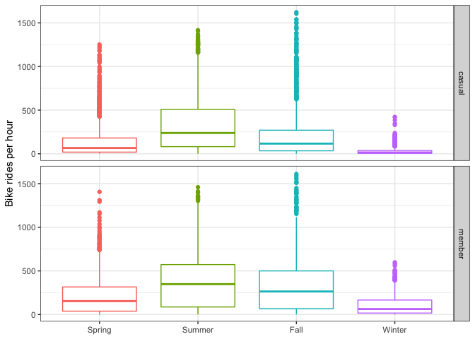<!-- -->

``` r
# Explain 
trips_per_hour %>% 
  filter(week_day %in% c(2:6)) %>% # workingdays
  ggplot(aes(hour,count_rides)) +
  geom_point(position = position_jitter(w=1, h=0),
             aes(color=member_casual),
             alpha = 0.5) + 
  theme_bw() +
  facet_wrap(~season_num,
             labeller = labeller(season_num = 
                                   c("1" = "Spring",
                                     "2" = "Summer",
                                     "3" = "Fall",
                                     "4" = "Winter")
             )) +
  labs(x = "Hour", 
       color = NULL,
       y = "Bike rides per hour")
```

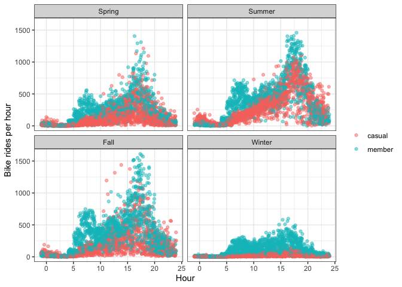<!-- -->

``` r
trips_per_hour %>% 
  filter(week_day %in% c(1,7)) %>% # weekends 
  ggplot(aes(hour,count_rides)) +
  geom_point(position = position_jitter(w=1, h=0),
             aes(color=member_casual),
             alpha = 0.5) + 
  theme_bw() +
  facet_wrap(~season_num,
             labeller = labeller(season_num = 
                                         c("1" = "Spring",
                                           "2" = "Summer",
                                           "3" = "Fall",
                                           "4" = "Winter")
  )) +
  labs(x = "Hour", 
       color = NULL,
       y = "Bike rides per hour")
```

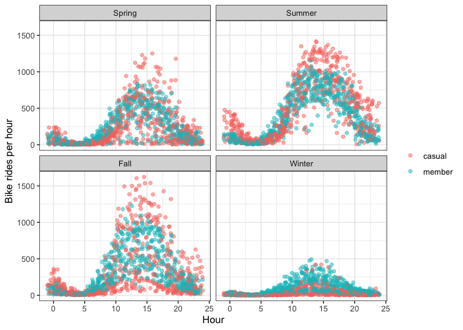<!-- -->
